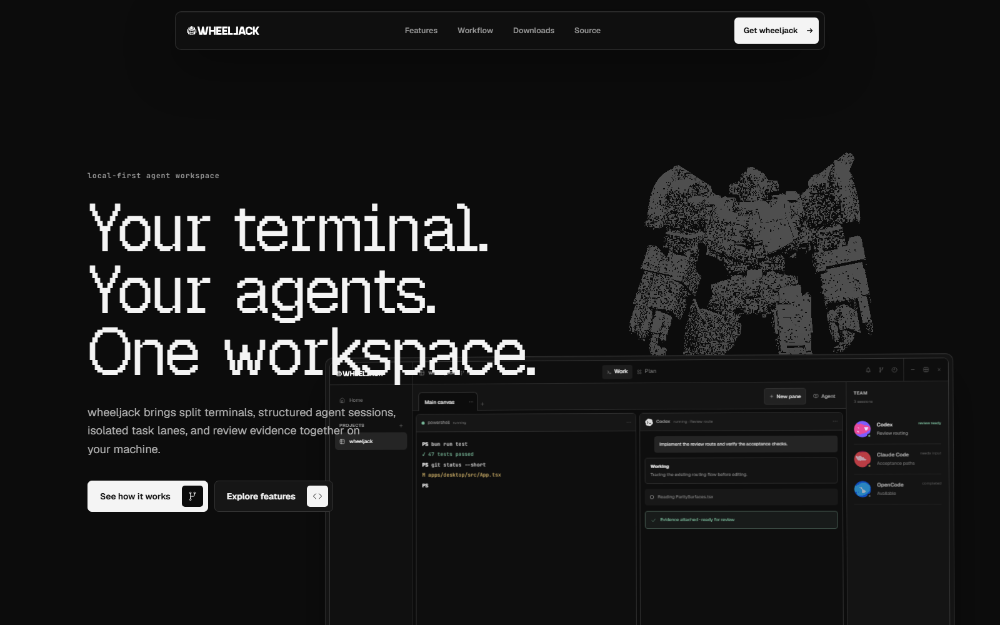

# wheeljack

wheeljack is a local-first desktop terminal multiplexer built with Tauri 2,
React, TypeScript, shadcn/ui, Sargam Icons, and Rust. It provides recursive
terminal splits, structured agent chat, an editable Plan board,
review-before-delivery routing, themes, activity drawers, and restart recovery.

Website: [wheeljack.dev](https://wheeljack.dev)

[](https://wheeljack.dev)

`wheeljack-core` is the durable authority for SQLite state, PTY and structured
agent sessions, routing, Git operations, and updates. The WebView owns
presentation and transient interaction only.

## Platforms and requirements

Release builds currently target Windows x64 and universal macOS. Linux is not
a supported release target yet.

wheeljack can always open a regular shell. Structured chat, approvals,
reasoning, tool activity, routing, and agent-managed Plan work require at least
one supported coding-agent CLI installed on `PATH` and authenticated outside
wheeljack:

| Adapter | Mode | Requirement |
| --- | --- | --- |
| Claude Code | Structured | Install and authenticate the `claude` CLI. |
| Codex CLI | Structured | Install and sign in to the `codex` CLI. |
| OpenCode | Structured | Install and authenticate `opencode`. |
| Pi | Structured | Install `pi` and complete `pi /login`. |
| Generic shell | Terminal | Uses the platform shell without structured agent features. |

wheeljack does not bundle agent subscriptions, credentials, or model access.
Provider availability, network use, usage limits, and cost remain governed by
the selected CLI and provider.

## Install

Download the latest Windows or macOS build from
[GitHub Releases](https://github.com/bildhaus/wheeljack/releases/latest), or run
wheeljack from source:

```powershell
git clone https://github.com/bildhaus/wheeljack.git
cd wheeljack
cd apps/desktop
bun install
bun tauri dev
```

## Usage

Open a project folder from Home, then create a shell or structured-agent pane
in Work. Panes can be split recursively; project tasks and agent routing
live in the Plan board alongside the workspace.

Managed agents can autonomously list workspace agents, message a peer, start a
bounded child agent, hand off a task, or request review. Configure each action
as **Allow automatically**, **Ask every time**, or **Deny** under Settings →
Agents. wheeljack enforces workspace, depth, child, concurrency, and rate limits
in the Rust core and records every request and result in Autonomy history.

## Local data and permissions

wheeljack has no hosted account or sync service. Projects, layouts, settings,
session history, and Plan state are stored locally in SQLite under the Tauri
app-data directory. Agent CLIs still communicate with their configured
providers, and the updater checks GitHub Releases when update checks are
enabled.

Agents start with their native default approval and sandbox policy. **Full
access** is an explicit per-project choice that maps to each agent's own
permission controls. Review proposed file changes and agent permission requests
before approving them, especially in unfamiliar repositories.

Current limitations:

- Windows and macOS are the only packaged and smoke-tested platforms.
- Structured features depend on compatible, authenticated CLI versions being
  discoverable on `PATH`.
- Windows portable builds may be unsigned; the release reports signing status,
  and unsigned builds can trigger SmartScreen or antivirus warnings.
- There is no cloud sync or remote collaboration layer.

## Verify and package on Windows

```powershell
cd apps/desktop
bun run test
bun run build
cd ../..
cargo test -p wheeljack-core -p wheeljack-desktop --locked
cargo clippy -p wheeljack-core -p wheeljack-desktop --all-targets --locked -- -D warnings
.\scripts\publish-desktop-windows.ps1
.\scripts\smoke-desktop-agent-memory-windows.ps1 -Executable .\artifacts\desktop\windows\wheeljack-windows-x64-portable.exe
.\scripts\smoke-desktop-windows.ps1 -Executable .\artifacts\desktop\windows\wheeljack-windows-x64-portable.exe
```

wheeljack stores production state under the Tauri app-local directory for
`com.omershatz.wheeljack`. On first launch it atomically imports the former
private-build `com.oshtz.wheeljack` profile, then falls back to the older
`wheeljack` and `com.oshtz.wheeljack.preview\preview` locations. Import runs
only while the new production database is empty. Every source database remains
untouched and the migrated database gets a pre-migration backup.

Architecture and adapter extension details are documented in
[`docs/architecture.md`](docs/architecture.md) and
[`docs/agent-adapters.md`](docs/agent-adapters.md).

## Release

Pull requests into `main` run repository contracts plus the path-conditioned
site and full native Windows/macOS validation lanes against GitHub's merge
result. Pushes to `main` rerun only the lightweight repository contracts;
ordinary `dev` pushes and tags do not start routine CI. Manual dispatch runs
every lane. The stable required check is `wheeljack CI / required`.

A manual `release_tag` dispatch from `main` prepares a release from the tagged
commit after confirming that it is contained in `main` and equals `vVERSION`;
tag pushes alone do not start signing or packaging.
Windows Authenticode signing is optional and reported explicitly; macOS
Developer ID signing and notarization are mandatory. Packages, updater
payloads, sidecar hashes, and `SHA256SUMS.txt` are uploaded to an unpublished
draft from jobs gated by the main-only `desktop-release` environment, with
server-reported digests verified. Existing published releases and
conflicting assets are never changed. Publish the verified draft manually so
partial releases never reach the app's `/releases/latest` check.

Site changes on `main` deploy `apps/site/dist` to the Cloudflare Pages project
through the main-only `site-production` environment. Deployment remains disabled
unless the `PUBLIC_SITE_ENABLED` repository variable is exactly `true`.

## Contributing and support

See [CONTRIBUTING.md](CONTRIBUTING.md) for setup, architecture constraints, and
the verification expected for pull requests. Participation is governed by the
[Code of Conduct](CODE_OF_CONDUCT.md). Use [SUPPORT.md](SUPPORT.md) for
bug-reporting guidance and [SECURITY.md](SECURITY.md) for private vulnerability
reporting.

## License

wheeljack is available under the [MIT License](LICENSE). See
[Third-party notices](THIRD_PARTY_NOTICES.md) for bundled dependencies.
